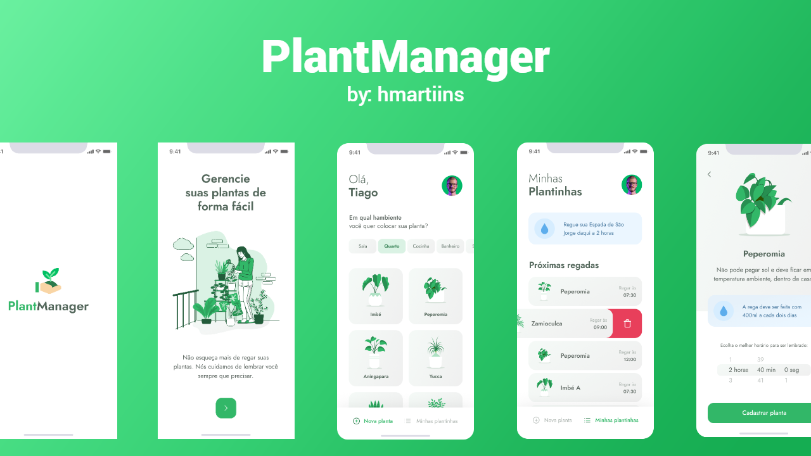

# PlantManager
### Aplicative designed to help plant caregivers remember to water their plants according to their demand, designed with react native and aiming that people captivate the desire to have plants, which contributes to the owner's health and the environment, even if on a small scale.
<br>

<h1 align="center">
    
</h1>

</br>

<p align="center">
  <a href="#technologies">Technologies</a>&nbsp;&nbsp;&nbsp;|&nbsp;&nbsp;&nbsp;
  <a href="#-layout">Getting started</a>&nbsp;&nbsp;&nbsp;|&nbsp;&nbsp;&nbsp;
  <a href="#-project">Project</a>&nbsp;&nbsp;&nbsp;|&nbsp;&nbsp;&nbsp;
  <a href="#-layout">Layout</a>&nbsp;&nbsp;&nbsp;|&nbsp;&nbsp;&nbsp;
  <a href="#-license">License</a>
</p>

<p align="center">
  
</p>


## Features and benefits
* Take good care of your plants;
* Visual notification;
* The benefits of having plants at home go far beyond the beauty of flowers - some, in addition to wildcards in decoration in strategic places such as the coffee table, even help to purify the air.
 
<br>
<details>
    <summary>You can see the benefits of having plants at home below!</summary>

```
1. Plants inspire relaxation:
It is impossible to observe the vibrant petals of the African violet (Saintpaulia ionantha)
without feeling the lull of color! According to NASA, it is scientific: the species causes a small
stimulus for the release of adrenaline in our body, which increases energy levels and
oxygenation, helping us to relax.

2. They are natural humidifiers:
Instead of buying a large, hard-to-camouflage home appliance, invest in
some American ferns (Nephrolepis exaltata) around the house. Plants release moisture
perspiration and help make the environment more pleasant.

3. Some are natural remedies:
According to the National Institutes of Health, aloe vera was known as the “plant of the
immortality ”in ancient Egypt and used to heal wounds. Nowadays, we usually use it to
treat sunburn and it is an active ingredient in several beauty treatments.

4. They inspire creativity:
Those who do creative work can benefit from plants! According to the gardening expert
from Costa Farms, Justin Hancock, colorful leaves bring inspiration and energize what's around you.

5. Can minimize allergies:
If you have allergies, you can use plants without flowers as your allies. The leaves of the chlorophyte
(Chlorophytum comosum) absorb allergens such as mold and dust. NASA's list of plants that can
cleaning the air shows that this species can eliminate almost 90% of the toxins from an environment. See 19 plants
that purify the air, according to NASA.

6. Plants clean the air:
The same research shows that ivy (Hedera helix) is number one in filtering the air, especially when
this has concentrations of formaldehyde.

7. Your colors soothe your eyes:
Among the decorative benefits of plants is, according to Good Housekeeping, the relief of tired eyes.
Watching the green leaves after hours of working in front of a computer can be a good idea, as the shade
is perceived by the brain as smooth.

8. They help with concentration:
A study by the Royal College of Agriculture found that students paid 70% more attention when in an environment
with plants. If your house doesn't have a lot of light, bet on some varieties that do well indoors.
When in doubt, choose bamboo - it also helps with energies related to Feng Shui.

9. They are decorative:
Plants are one of the essential elements of really stylish homes. In addition to the undeniable natural qualities,
they can also be used for their colors, complementing the decor.

10. Stress goes away:
Are you pulling your hair out at work? A potted plant on the table can help you take a deep breath and calm down.
A report by the Journal of Environmental Psychology points out that flowers like Anthurium help to lower stress levels.
```
</details>
<span>By Débora Fernandes - Journalist (https://exame.com/casual/10-bons-motivos-para-voce-ter-mais-plantas-em-casa/)</span>
</br>

## 🧪 Technologies

This project was developed using the following technologies:

- [React Native](https://reactnative.dev/)
- [Expo](https://expo.io/)
- [TypeScript](https://www.typescriptlang.org/)

## 🚀 Getting started

Clone the project and access the folder

```bash
# Clone the repository
$ git clone https://github.com/JhonataAugust0/PlantManager.git 
# Access the project folder in the terminal
cd PlantManager
```

Follow the steps below
```bash
# Install the dependencies
$ npm install

# Start the project
$ expo start
# Start json-server:
npm install -g json-server
cd /src/services/
# Change the baseUrl to your IP address in the api.ts file
Execute json-server db.json --host [your IP address] --port 3333 --delay 700
```
## 💻 Project
App to always remember to water your plants 🌱

This is a project developed during the **[Next Level Week](https://nextlevelweek.com/)**, presented by **[@Rocketseat](https://github.com/Rocketseat)** during April 19-25, 2021.

## 🔖 Layout

You can view the project layout through the links below:

- [Layout](https://www.figma.com/file/IhQRtrOZdu3TrvkPYREzOy/PlantManager) 

Remembering that you need to have a [Figma](http://figma.com/) account to access it.

## 📝 License

This project is licensed under the MIT License. See the [LICENSE](LICENSE.md) file for details.
---

Made with 💜 by [JhonataAugust0](https://github.com/JhonataAugust0/) 
